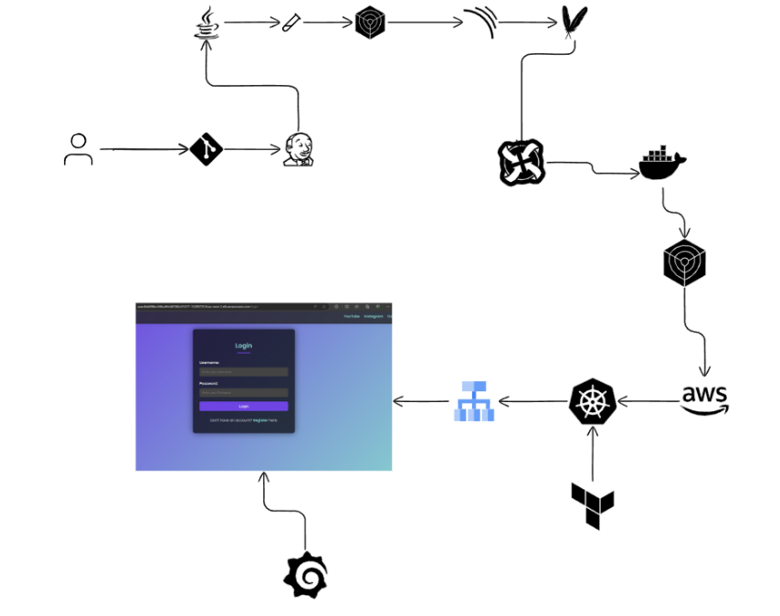

<<<<<<< HEAD
# Dev_project_sub
=======
### Full-Stack Blog App 
```
Job Scenario:
I was tasked with setting up a CI/CD pipeline for a full-stack blogging app hosted on GitHub.
The project involves integrating Jenkins for build and deployment, using SonarQube for code quality checks,
Nexus for artifact management, and Docker for containerizing the application.
Once deployed, we will monitor the application using Prometheus, Blackbox Exporter, and visualize it with Grafana.
I integrated Email notification script using Groovy to send alerts when the pipeline fails or succeeds. 
```

 
---

### Project Structure.

``` 
/full-stack-blogging-app
├── /ci-scripts
│   ├── install_jenkins.sh
│   ├── install_docker.sh
│   ├── install_blackbox.sh
│   ├── prometheus.yml
│   └── grafana_dashboard.json
├── /kubernetes
│   ├── deployment.yml
│   ├── service.yml
│   ├── role.yaml
│   ├── rolebinding.yaml
│   └── serviceaccount.yaml
├── /terraform
│   ├── main.tf
│   ├── variables.tf
│   ├── outputs.tf
├── /src
│   ├── app.js
│   ├── Dockerfile
│   └── ...
├── README.md
```

---

####
---

```markdown
# Full-Stack Blogging App CI/CD Project 🚀

## Project Overview
This project demonstrates a complete **CI/CD pipeline** setup for deploying a full-stack blogging application, integrating modern tools like Jenkins, SonarQube, Nexus, Docker, Kubernetes (EKS), and Prometheus for monitoring. This repository showcases the **automation of code quality checks, artifact management, application deployment, and monitoring** in a production-like environment.

## Key Technologies & Tools
- Jenkins: Continuous Integration and Continuous Deployment.
- SonarQube: Static code analysis for quality and security checks.
- Nexus: Artifact repository manager.
- Docker: Containerization of the application.
- Kubernetes (EKS): Orchestration of containerized applications.
- Prometheus & Grafana: Monitoring and visualization of application performance.
- Blackbox Exporter: Probing application availability and uptime monitoring.

## Objectives
1. Automate the CI/CD pipeline: Automate building, testing, and deploying the blogging app.
2. Enhance code quality and security: Use SonarQube for static code analysis and Trivy for vulnerability scans.
3. Deploy to Kubernetes (EKS): Use Terraform to deploy and manage Kubernetes infrastructure on AWS.
4. Monitor the application: Use Prometheus, Blackbox Exporter, and Grafana for real-time monitoring and alerting.

## Repository Structure
- `/ci-scripts`: Shell scripts for installing Jenkins, Docker, Prometheus, Grafana, and Blackbox Exporter.
- `/kubernetes`: Kubernetes manifests for deploying the app and setting up roles and access.
- `/terraform`: Infrastructure as Code (IaC) files to provision an EKS cluster.
- `/src`: The source code and Dockerfile for the blogging application.

## CI/CD Pipeline Overview

1. **GitHub Integration**: Jenkins pulls the latest changes from the GitHub repository and triggers the pipeline.
2. **Build & Test**:
   - The code is compiled and built using Maven.
   - Code analysis is done using SonarQube.
   - Trivy scans for vulnerabilities.
3. **Docker & Nexus**:
   - Jenkins builds a Docker image for the application.
   - The image is tagged and pushed to DockerHub.
   - Artifacts are pushed to Nexus.
4. **Kubernetes Deployment**:
   - The app is deployed to an EKS cluster.
   - Kubernetes handles scaling and service management.
5. **Monitoring**:
   - Prometheus scrapes metrics from the Blackbox Exporter.
   - Grafana visualizes application uptime, health, and other critical metrics.
